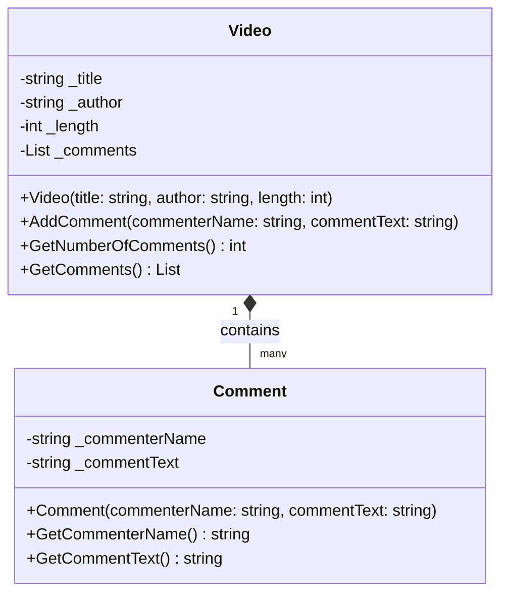
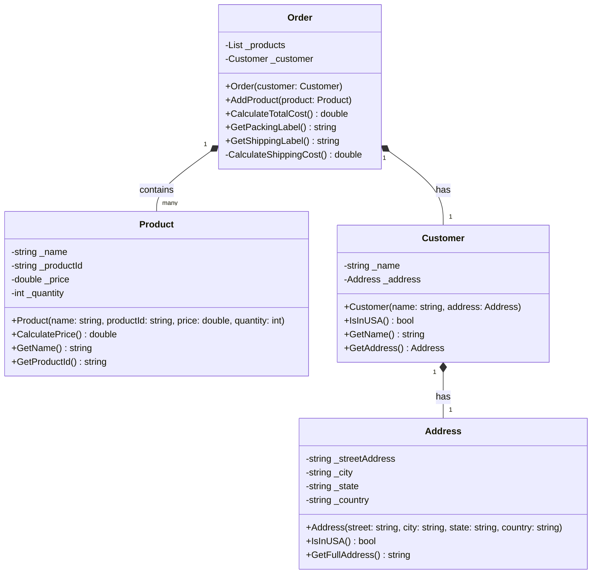

# Class Diagrams for Week 4 Programming Assignments

## YouTube Video Program

### Class Diagram

### Program Flow

1. The program starts by creating Video objects
2. Each Video can have multiple Comments added to it
3. Comments are stored within their respective Video objects
4. Program displays information for each video:
   - Video details (title, author, length)
   - Number of comments
   - List of all comments

### Class Relationships

- A Video can have many Comments (composition relationship)
- Each Comment belongs to one Video
- Video manages its Comments through a private List

### Responsibilities

#### Video Class

- Store video information (title, author, length)
- Manage a collection of comments
- Calculate number of comments
- Provide access to comments list

#### Comment Class

- Store comment information (commenter name and text)
- Provide access to comment details

This design demonstrates encapsulation by:

- Making member variables private
- Providing public methods for necessary operations
- Keeping related data and behaviors together
- Managing object relationships appropriately

## Online Ordering Program

### Class Diagram

### Program Flow

1. Create an Address object for the customer
2. Create a Customer object with the address
3. Create an Order for the customer
4. Create Product objects with details
5. Add Products to the Order
6. Generate shipping and packing labels
7. Calculate total cost including shipping

### Class Relationships

- An Order contains multiple Products (composition)
- An Order has one Customer (composition)
- A Customer has one Address (composition)
- Address influences shipping cost through Customer

### Responsibilities

#### Order Class

- Manage collection of products
- Calculate total cost (including shipping)
- Generate packing and shipping labels
- Handle customer association

#### Product Class

- Store product information
- Calculate individual product cost
- Provide access to product details

#### Customer Class

- Store customer information
- Determine shipping location (USA or international)
- Manage customer's address

#### Address Class

- Store address components
- Determine if address is in USA
- Format full address string

This design demonstrates encapsulation by:

- Keeping address logic within Address class
- Maintaining customer-address relationship
- Protecting member variables
- Providing clear public interfaces
- Managing complex relationships between objects
